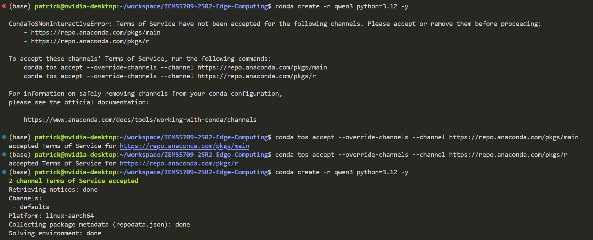

# Set up Environment

First, we need to install Miniconda to manage the experiment environment more easily.

```
cd ~
mkdir miniconda && cd miniconda
wget https://repo.anaconda.com/miniconda/Miniconda3-latest-Linux-aarch64.sh
chmod +x Miniconda3-latest-Linux-aarch64.sh
./Miniconda3-latest-Linux-aarch64.sh
```

Follow the instructions to install Miniconda. Remember to answer `yes` to the question `Proceed with initialization? [yes|no]`. Otherwise, you need to source the conda init script manually. After installation, reopen the terminal to make the changes take effect.

You can validate the installation by running `conda --version`.

```
(base) patrick@nvidia-desktop:~/workspace/IEMS5709-25R2-Edge-Computing$ conda --version
conda 25.11.1
```

Then, we need to create a new environment for our experiments.
```
conda create -n qwen3 python=3.12 -y
conda activate qwen3
```

`Note`: You may be prompted to accept Terms of Service when creating the environment. Just Use the two commands it suggests to continue.



Now, let's install the required packages.
```
pip install -U qwen-asr
pip install -U qwen-tts
```