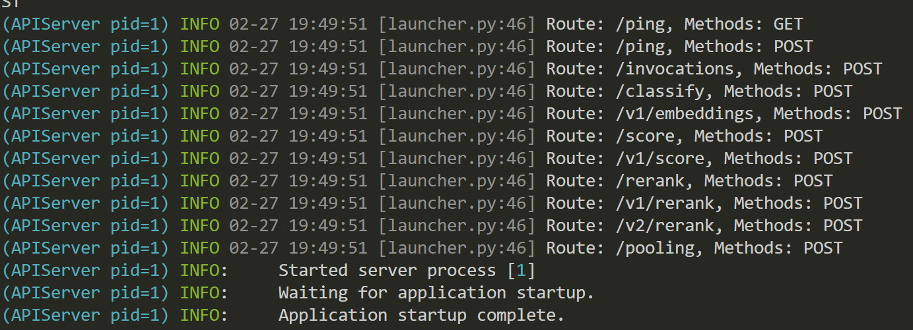

# Lab 1: Edge AI First Try

In this lab, you will have a first try on Edge AI by serving the LLM, TTS, and ASR models on the Jetson Orin. You will be using the following models:

| Model Type | Model Name                    |
|---------|----------------------------------|
| LLM     | Qwen3-4B-Instruct                |
| TTS     | Qwen3-TTS-12Hz-0.6B-Base         |
| ASR     | Qwen3-ASR-0.6B                   |


## Environment Setup

First, you need to set up the environment by following the instructions in the [Environment Setup](./Environment.md) file. With the `qwen3` environment created and activated, you can continue the following steps.

## Model Download

Download the models to local directory by running the following commands:

```
conda activate qwen3
pip install -U huggingface_hub
python download_model.py
```
Two models will be downloaded to the local directory `Qwen3-ASR-0.6B`, `Qwen3-TTS-12Hz-0.6B-Base` and `Qwen3-4B-quantized.w4a16` under `Lab1` directory.

## LLM Serving

```
cd Lab1

docker run \
  --rm -it \
  --network host \
  --shm-size=8g \
  --ulimit memlock=-1 \
  --ulimit stack=67108864 \
  --runtime=nvidia \
  --name=vllm \
  -v $PWD/Qwen3-4B-quantized.w4a16:/root/.cache/huggingface/Qwen3-4B-quantized.w4a16 \
  ghcr.io/nvidia-ai-iot/vllm:latest-jetson-orin \
  vllm serve /root/.cache/huggingface/Qwen3-4B-quantized.w4a16 \
    --gpu-memory-utilization 0.35 \
    --max-model-len 4096 \
    --max-num-batched-tokens 2048
```

Starting the vLLM server container will take a few minutes. You should be able to see the following output after the container is started successfully.


After the container is started, test the LLM by running the following command:

```
python eval_llm.py
```

This script will send a request to the vLLM server and print the response along with the performance metrics.

```bash
--- Performance Test Results ---
Time to First Token (TTFT): 88.65 ms
Subsequent Token Throughput: 29.48 tokens/sec
Total Response Time: 34795.54 ms
Total Generated Tokens: 1024
```
From the example output, we can see that the TTFT is less than 100 ms and the throughput is nearly 30 tokens/sec. This is already a decent performance for a LLM model running on an edge device.

## ASR (Automatic Speech Recognition)

```bash
python eval_asr.py
```

The example script transcribes the audio file `resources/asr_en.wav` and prints the transcription. Replace the audio file with your own for more testing.

## TTS (Text-to-Speech)

```bash
python eval_tts.py
```

The example script clones the voice of the speaker in the audio file `resources/clone.wav` and saves the cloned audio to `output_voice_clone.wav`. Replace `resources/clone.wav` with your voice recording to clone your own voice.

## References
https://huggingface.co/Qwen/Qwen3-ASR-0.6B

https://huggingface.co/Qwen/Qwen3-TTS-12Hz-0.6B-Base

https://www.jetson-ai-lab.com/tutorials/genai-on-jetson-llms-vlms/